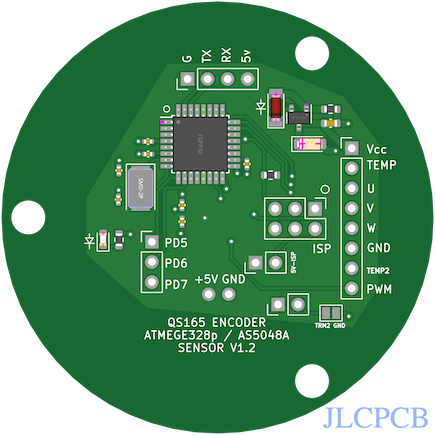

# QS165 motor magentic encoder development

Project area for encoders retrofit on the QS165 motor. 

## An attempt to get the AS5048 to run based on an atmega328p [[LINK](AS5048_atmega328p/README.md)]

Notes: Never really got this to work. 
* decoupling caps werent doing their job on original design which could be the cause;
* original xtal just didnt work;
* this may have resulted in serial writing bad characters;
* and programming problems. 

And, it's not clear the clock speed would ever be fast enough for SPI communications and reasonable output
Note also -- the PCB was set up for 5v. 

## An attempt to create line isolation for AS5048 to run based on an atmega328p [[LINK](AS5048_isolation/README.md)]

Notes:
Was not bad, just sort of complicated to use SPI with ESC. 

