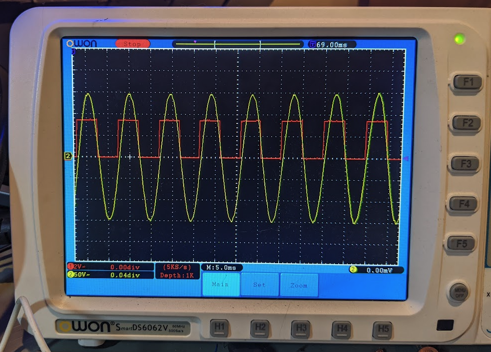

# QS165 motor magentic encoder with hall output


One scope probe (red) connected to "W" output of board, and another probe (yellow) is tied to the phase output of the QS165. The QS165 is turned by hand as described here: 


## An encoder retrofit for the QS165 motor [[See this link](AS5048_extburn/README.md)].

This encoder is designed as a drop in replacement to the QS165 motor and uses an AS5047 to generates UVW output. In order for this to work you'll need to program the AS5047 with an external CPU. So basically this is **unnecessarily expensive requiring purchase of a custum PCB and a teensy to program the board. It is unnecessarily complicated in that it requires a custom programmer dongle, common bench testing equipment, assembling a board, and knowledge of programming**. 

On the other hand I'm not aware of a lot of alternatives. 

### **Acknowledgement:**
* [CircularBuffer](https://github.com/CircularBuffer/AS5047P) supplied code to burn the AS5047 non-volatile memory.
* [David Molony](https://github.com/davidmolony) kindly helped with some development of early boards. 

## Schematic


## To build board and test
* Order and construct [this kicad board](AS5047_extburn/README.md)
* Create the programming dongle shown below
* Select between 3.3V versus 5V operation with solder jumper
* Please note: using 5V on the 3.3V definitely kills the chip
* Connect up up the finished PCB on the bench or motor
* Confirm the initial outputs of the AS5047 with an oscilloscope

## Programming
The AS5047 uses one time progromming to change some of it's registers permanantly. Note that programming definitely means you get **one time** to program the chip -- so be careful. 

As [CircularBuffer](https://github.com/CircularBuffer/AS5047P) points out, that code will probably work on a number of platforms. This works for me:

* Review [main.ino](https://github.com/owhite/QS165_encoder/tree/main/FIRMWARE/encoder/src/main.ino) carefully to understand how variables are sent to the AS5047 and the program flow
* Default variables for QS165 are set in main.ino using the lines:

```
  AS5047P_SetFieldInRegister(&encInstanceA, AS5047P_SETTINGS1, AS5047P_SETTINGS1_PWMON, 1);
  AS5047P_SetFieldInRegister(&encInstanceA, AS5047P_SETTINGS1, AS5047P_SETTINGS1_UVW_ABI, 1);
  AS5047P_SetFieldInRegister(&encInstanceA, AS5047P_SETTINGS2, AS5047P_SETTINGS2_UVWPP, 6);
```

Note: the QS165 has 7 polepairs, and according to the AS5047 docs you pass it a '6'. 

* Salt to taste if you have something else
* Load code on teensy board using the platformio environment to install [code](https://github.com/owhite/QS165_encoder/tree/main/FIRMWARE/encoder)
* Once programmed, connect teensy to encoder board using programming-dongle
* Start up a serial terminal
* While program is running, review the program is effectively communicating with the encoder board
* Confirm you like the actual output of the pins on encoder board
* Entering single characters into the serial input gets ready for the burn
* Typing anything besides "x" shows you serial input is working
* Enter "x" when youre ready to burn
* main.ino will report "no errors received, test if burn complete" if it worked
* Once it is programmed, youre done, and the AS5047 will not let you burn again.

## Programming hardware


An example of programming a earlier version of the encoder board with a teensy 3.6, ribbon cable and 6 pin connector. 


Pogo pins may be helpful for making quick connections to the board. 

## Shout out to my friends:
* Need a nice open source motor controller? Try the [MP2](https://github.com/badgineer/MP2-ESC). 
* Need some firmware to run on the motor controller? Try [MESC](https://github.com/davidmolony/MESC_Firmware). 
* A discussion of the QS165 on [endless-sphere](https://endless-sphere.com/forums/viewtopic.php?p=1748544).
* Two great sites for PCB and PCBA: [pcbway.com](https://www.pcbway.com/) and [jlcpcb.com](https://jlcpcb.com/).

## Final notes: some examples of other attempts to create an encoder
### **Attempt: AS5048 with line isolation [[LINK](AS5048_isolation/README.md)].**

Note: was not bad, just sort of complicated to use SPI with ESC.

### **Attempt: atmega328p to AS5048 [[LINK](AS5048_atmega328p/README.md)].**

Notes: Never really got this to work. 
* decoupling caps werent doing their job on original design which could be the cause;
* original xtal just didnt work;
* this may have resulted in serial writing bad characters;
* and programming problems. 

And, it's not clear the clock speed would ever be fast enough for SPI communications and reasonable output

PCB was set up for 5v. 

### **Attempt: AS5047 with on board CPU [[LINK](AS5047_atmega328p/README.md)].** 
This actually generated some reasonable output, but the downside it required the atmega to push SPI instructions to the AS5047. 


