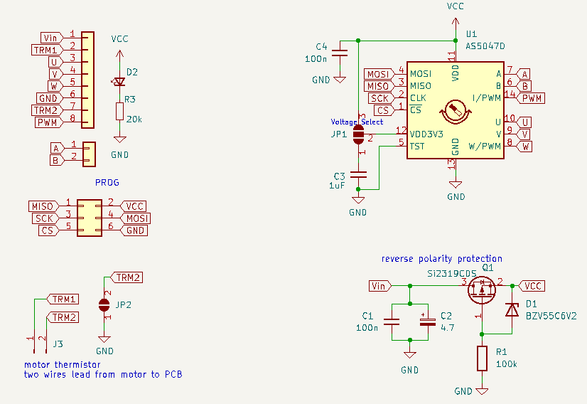

[](http://js.org)

# [flowchart.js](http://flowchart.js.org)

# QS165 motor magentic encoder with hall output


```flowchart
st=>start: Start:>http://www.google.com[blank]
e=>end:>http://www.google.com
op1=>operation: My Operation
sub1=>subroutine: My Subroutine
cond=>condition: Yes
or No?:>http://www.google.com
io=>inputoutput: catch something...
para=>parallel: parallel tasks

st->op1->cond
cond(yes)->io->e
cond(no)->para
para(path1, bottom)->sub1(right)->op1
para(path2, top)->op1
```

## An encoder retrofit for the QS165 motor [[See this link](AS5048_extburn/README.md)].

This encoder uses an AS5047 to generates UVW output and is programmable with an external CPU. 

This is unnecessarily expensive requiring purchase of a custum PCB and a teensy to program the board. It is unnecessarily complicated in that it requires a custom programmer dongle, common bench testing equipment, assembling a board, and knowledge of programming. On the other hand I'm not aware of a lot of alternatives. 

### **Acknowledgement:**
* Thanks to [CircularBuffer](https://github.com/CircularBuffer/AS5047P) for code to OTP burn the AS5047 non-volatile memory!
* [David Molony](https://github.com/davidmolony) kindly helped with some development

## Schematic


## Board testing
* Order and construct [this kicad board](AS5047_extburn/README.md)
* Create the programming dongle shown below
* Select between 3.3V versus 5V operation with solder jumper. 
* Connect up up the finished PCB on the bench or motor
* Confirm the initial outputs of the AS5047 with an oscilloscope

## Programming
Note that OTP programming definitely means you get **one time** to program the chip so be careful. 

* Platformio environment required to install teensy [code](https://github.com/owhite/QS165_encoder/tree/main/FIRMWARE/encoder)
* Review [main.ino](https://github.com/owhite/QS165_encoder/tree/main/FIRMWARE/encoder/src/main.ino) carefully to understand how variables are sent to the AS5047 and the program flow. 
* Default variables for QS165 are set in main.ino, salt to taste if you have something else
* Load code on teensy board
* Connect teensy to encoder board using programming-dongle
* Start serial terminal
* While program is running, review the program is effectively communicating with the encoder board
* Confirm you like the actual output of the pins on encoder board
* Entering single characters into the serial input gets ready for the burn
* Typing anything besides "x" shows you serial input is working
* Enter "x" when youre ready to burn

## Programming hardware


An example of programming a prototype board with a teensy 3.6, ribbon cable and 6 pin connector. 


Pogo pins may be helpful for making quick connections to the board. 

## Examples of other attempts to create an encoder
### **Attempt: AS5048 with line isolation [[LINK](AS5048_isolation/README.md)].**

Note: was not bad, just sort of complicated to use SPI with ESC.

### **Attempt: atmega328p to AS5048 [[LINK](AS5048_atmega328p/README.md)].**

Notes: Never really got this to work. 
* decoupling caps werent doing their job on original design which could be the cause;
* original xtal just didnt work;
* this may have resulted in serial writing bad characters;
* and programming problems. 

And, it's not clear the clock speed would ever be fast enough for SPI communications and reasonable output

PCB was set up for 5v. 

### **Attempt: AS5047 with on board CPU [[LINK](AS5047_atmega328p/README.md)].** 
This actually generated some reasonable output, but the downside it required the atmega to push SPI instructions to the AS5047. 


